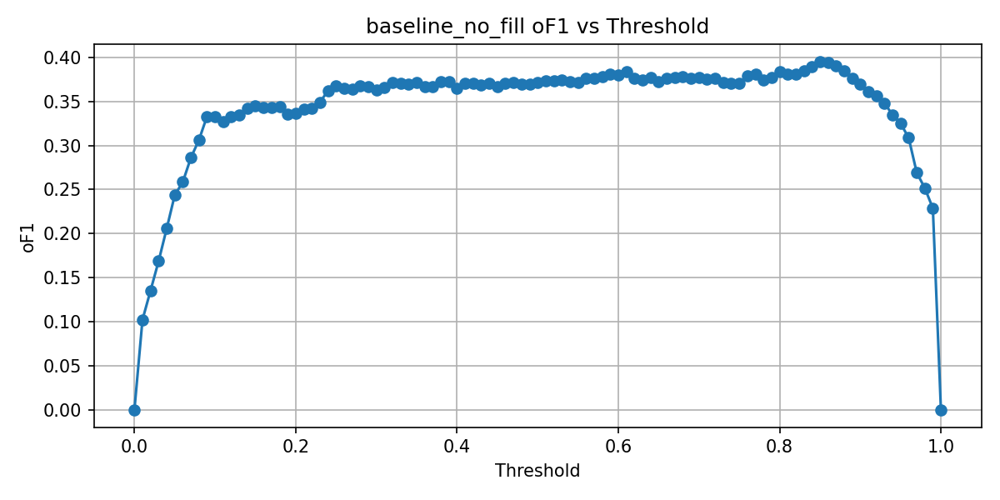
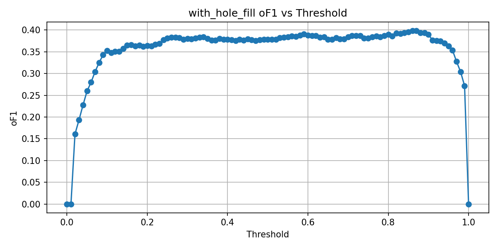
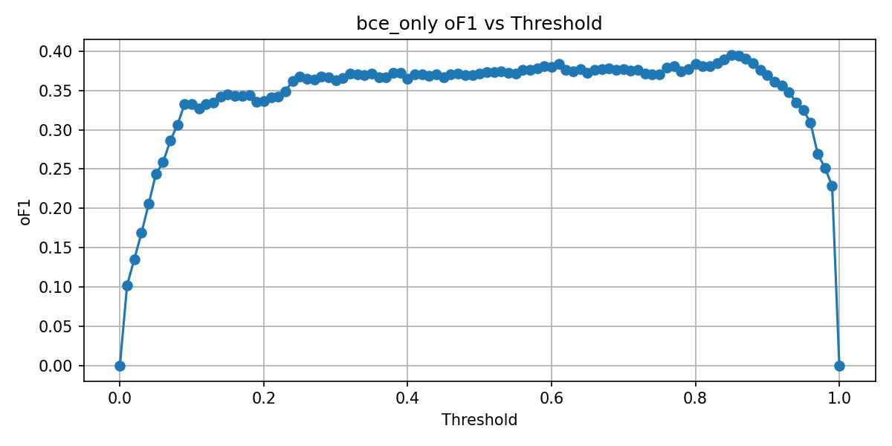

# Ablation Experiments Report

## Summary

- **baseline_no_fill**: Baseline without hole filling
- **with_hole_fill**: Enable hole filling postprocessing
- **bce_only**: Model trained with BCE only (provide weight path in AB_BCE_WEIGHTS)

## Fixed-threshold comparison (0.3 vs 0.5)

|Experiment|Thresh|oF1|TP|FP|FN|
|-|-|-|-|-|-|
|baseline_no_fill|0.3|0.3628|232|387|428|
|baseline_no_fill|0.5|0.3710|225|328|435|
|with_hole_fill|0.3|0.3802|219|273|441|
|with_hole_fill|0.5|0.3782|212|249|448|
|bce_only|0.3|0.3628|232|387|428|
|bce_only|0.5|0.3710|225|328|435|

## Plots and CSVs

### baseline_no_fill

CSV: baseline_no_fill_of1.csv

### with_hole_fill

CSV: with_hole_fill_of1.csv

### bce_only

CSV: bce_only_of1.csv

